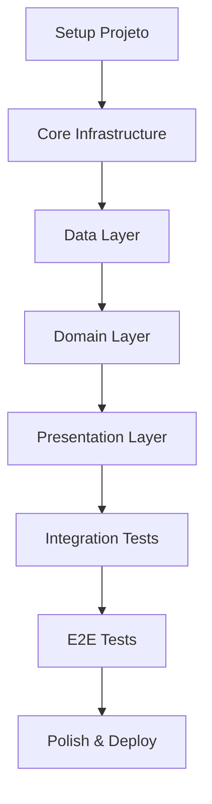

# FLUTTER WIDGETS - Plano de Implementação

**Versão**: 1.0  
**Data**: 2025-11-12  
**Status**: Aprovado

---

## 📑 Índice

1. [Visão Geral](#visão-geral)
2. [Estratégia de Implementação](#estratégia-de-implementação)
3. [Fases do Projeto](#fases-do-projeto)
4. [Milestones](#milestones)
5. [Ordem de Implementação](#ordem-de-implementação)
6. [Riscos e Mitigações](#riscos-e-mitigações)
7. [Definição de Pronto](#definição-de-pronto)

---

## 1. Visão Geral

### 1.1 Objetivo
Implementar aplicativo educacional Flutter com arquitetura MVVM, seguindo práticas de TDD (Test-Driven Development) e garantindo alta qualidade de código.

### 1.2 Duração Estimada
**5 semanas** (25 dias úteis)

### 1.3 Abordagem
- **Incremental**: Features implementadas e testadas progressivamente
- **Test-First**: Testes escritos antes ou junto com a implementação
- **Bottom-Up**: Começar pelas camadas inferiores (Data → Domain → Presentation)
- **MVP First**: Priorizar funcionalidades core para ter app funcional rapidamente

---

## 2. Estratégia de Implementação

### 2.1 Princípios

#### 🎯 **Test-Driven Development (TDD)**
```
Ciclo TDD:
1. Red:   Escrever teste que falha
2. Green: Implementar código mínimo para passar
3. Refactor: Melhorar código mantendo testes verdes
```

#### 🏗️ **Bottom-Up Architecture**
```
Ordem de Implementação:
1. Data Layer (Models, DataSources, Repositories)
2. Domain Layer (Entities, Use Cases)
3. Presentation Layer (ViewModels, Views)
```

#### 📦 **Feature-Based Development**
Cada feature completa antes de passar para a próxima:
- ✅ Data Layer completa
- ✅ Domain Layer completa
- ✅ Presentation Layer completa
- ✅ Testes completos (Unit + Integration + E2E)

#### 🔄 **Continuous Integration**
- Rodar testes a cada commit
- Manter cobertura acima de 80%
- 0 lint warnings

---

### 2.2 Dependências Entre Tarefas



---

## 3. Fases do Projeto

### 📦 **FASE 0: Setup e Fundação** (Dias 1-3)

**Objetivo**: Preparar ambiente e estrutura base do projeto

#### **Tarefas**:

**0.1 - Configuração Inicial**
- [ ] Verificar Flutter SDK atualizado (`flutter doctor`)
- [ ] Criar projeto Flutter (`flutter create flutter_widgets`)
- [ ] Configurar Git e `.gitignore`
- [ ] Adicionar documentação inicial (README.md)

**0.2 - Estrutura de Pastas**
- [ ] Criar estrutura de pastas conforme arquitetura:
  ```
  lib/
  ├── core/
  │   ├── constants/
  │   ├── themes/
  │   ├── utils/
  │   └── di/
  ├── data/
  │   ├── models/
  │   ├── repositories/
  │   └── datasources/
  ├── domain/
  │   ├── entities/
  │   └── repositories/
  ├── presentation/
  │   ├── views/
  │   ├── viewmodels/
  │   └── widgets/
  └── main.dart
  
  test/
  ├── unit/
  ├── integration/
  └── e2e/
  ```

**0.3 - Dependências**
- [ ] Adicionar dependências ao `pubspec.yaml`:
  - provider (state management)
  - get_it + injectable (DI)
  - freezed + json_serializable (code generation)
  - shared_preferences (local storage)
  - logger
  - flutter_syntax_view
- [ ] Adicionar dev_dependencies:
  - flutter_lints + very_good_analysis
  - mockito + build_runner
  - integration_test
- [ ] Rodar `flutter pub get`
- [ ] Rodar `flutter pub run build_runner build` (initial)

**0.4 - Configuração de Linting**
- [ ] Criar `analysis_options.yaml`:
  ```yaml
  include: package:very_good_analysis/analysis_options.yaml
  
  linter:
    rules:
      public_member_api_docs: false
      lines_longer_than_80_chars: false
  ```
- [ ] Verificar `flutter analyze` sem warnings

**0.5 - Dependency Injection Setup**
- [ ] Criar `lib/core/di/injection.dart` com get_it setup
- [ ] Criar `lib/core/di/injection.config.dart` (gerado)
- [ ] Configurar @Injectable annotations
- [ ] Testar DI básico

**0.6 - Tema e Constantes**
- [ ] Criar `lib/core/themes/app_theme.dart` (Material 3)
- [ ] Criar `lib/core/constants/app_colors.dart`
- [ ] Criar `lib/core/constants/app_strings.dart`
- [ ] Criar `lib/core/constants/app_sizes.dart`

**Critérios de Conclusão**:
- ✅ Projeto compila sem erros
- ✅ `flutter analyze` retorna 0 issues
- ✅ Estrutura de pastas criada
- ✅ DI configurado e funcionando

---

### 📦 **FASE 1: Data Layer - Fundação** (Dias 4-6)

**Objetivo**: Implementar camada de dados com models e data sources

#### **Tarefas**:

**1.1 - Entities (Domain)**
- [ ] Criar `lib/domain/entities/widget_category.dart`
- [ ] Criar `lib/domain/entities/flutter_widget_entity.dart`
- [ ] Criar `lib/domain/entities/widget_property.dart`
- [ ] Criar `lib/domain/entities/difficulty_level.dart` (enum)
- [ ] **Testes**: `test/unit/domain/entities/` (testes básicos de igualdade)

**1.2 - Models (Data)**
- [ ] Criar `lib/data/models/widget_category_model.dart` com Freezed
- [ ] Criar `lib/data/models/flutter_widget_model.dart` com Freezed
- [ ] Criar `lib/data/models/widget_property_model.dart` com Freezed
- [ ] Adicionar métodos `toEntity()` e `fromEntity()`
- [ ] Rodar `build_runner` para gerar código
- [ ] **Testes**: `test/unit/data/models/` (100% cobertura)
  - Testar serialização JSON
  - Testar conversão para Entity
  - Testar copyWith

**1.3 - Data Sources**
- [ ] Criar `lib/data/datasources/local_data_source.dart` (interface)
- [ ] Criar `lib/data/datasources/local_data_source_impl.dart`
  - Usar `shared_preferences` para favoritos
  - Dados mockados em JSON (assets ou hardcoded inicial)
- [ ] **Testes**: `test/unit/data/datasources/local_data_source_test.dart`
  - Mock SharedPreferences
  - Testar CRUD de favoritos

**1.4 - Repository Interface (Domain)**
- [ ] Criar `lib/domain/repositories/widget_repository.dart` (abstract)
  ```dart
  abstract class WidgetRepository {
    Future<List<WidgetCategory>> getCategories();
    Future<List<FlutterWidgetEntity>> getWidgetsByCategory(String categoryId);
    Future<FlutterWidgetEntity> getWidgetById(String id);
    Future<List<FlutterWidgetEntity>> getFavoriteWidgets();
    Future<void> toggleFavorite(String widgetId);
    Future<List<FlutterWidgetEntity>> searchWidgets(String query);
  }
  ```

**1.5 - Repository Implementation (Data)**
- [ ] Criar `lib/data/repositories/widget_repository_impl.dart`
- [ ] Implementar todos os métodos da interface
- [ ] Injetar LocalDataSource via constructor
- [ ] **Testes**: `test/unit/data/repositories/widget_repository_impl_test.dart`
  - Mock LocalDataSource
  - Testar todos os métodos
  - Testar error handling

**1.6 - Mock Data**
- [ ] Criar `lib/data/datasources/mock_data.dart`
- [ ] Popular com pelo menos 30 widgets em 6 categorias:
  - Layout: Container, Row, Column, Stack, Padding, Center, Align, Expanded, Flexible
  - Material: ElevatedButton, TextButton, IconButton, Card, AppBar, BottomNavigationBar
  - Cupertino: CupertinoButton, CupertinoNavigationBar, CupertinoTextField
  - Input: TextField, Checkbox, Radio, Switch, Slider
  - Animation: AnimatedContainer, Hero, AnimatedOpacity, FadeTransition
  - Scrolling: ListView, GridView, SingleChildScrollView, PageView

**Critérios de Conclusão**:
- ✅ Todos os models com Freezed funcionando
- ✅ Repository implementado e testado
- ✅ Cobertura de testes ≥ 90% na Data Layer
- ✅ Mock data com 30+ widgets

---

### 📦 **FASE 2: Domain Layer - Use Cases** (Dias 7-9)

**Objetivo**: Implementar lógica de negócio através de Use Cases

#### **Tarefas**:

**2.1 - Base Use Case**
- [ ] Criar `lib/domain/usecases/usecase.dart` (interface genérica)
  ```dart
  abstract class UseCase<Type, Params> {
    Future<Type> execute(Params params);
  }
  ```

**2.2 - Use Cases - Categorias**
- [ ] Criar `lib/domain/usecases/get_categories_usecase.dart`
- [ ] **Teste**: `test/unit/domain/usecases/get_categories_usecase_test.dart`
  - Mock repository
  - Testar chamada ao repository
  - Testar retorno correto

**2.3 - Use Cases - Widgets**
- [ ] Criar `lib/domain/usecases/get_widgets_by_category_usecase.dart`
- [ ] Criar `lib/domain/usecases/get_widget_by_id_usecase.dart`
- [ ] **Testes**: `test/unit/domain/usecases/*_test.dart` para cada

**2.4 - Use Cases - Favoritos**
- [ ] Criar `lib/domain/usecases/get_favorite_widgets_usecase.dart`
- [ ] Criar `lib/domain/usecases/toggle_favorite_usecase.dart`
- [ ] **Testes**: Testar lógica de toggle e persistência

**2.5 - Use Cases - Busca**
- [ ] Criar `lib/domain/usecases/search_widgets_usecase.dart`
- [ ] Implementar lógica de busca (nome, descrição, tags)
- [ ] **Teste**: Testar diferentes queries e resultados

**2.6 - Registrar no DI**
- [ ] Adicionar @Injectable em todos os Use Cases
- [ ] Rodar `build_runner` para gerar injection config
- [ ] Verificar DI funcionando

**Critérios de Conclusão**:
- ✅ Todos os Use Cases implementados
- ✅ 100% cobertura de testes nos Use Cases
- ✅ DI configurado corretamente

---

### 📦 **FASE 3: Presentation Layer - ViewModels** (Dias 10-13)

**Objetivo**: Implementar ViewModels com ChangeNotifier

#### **Tarefas**:

**3.1 - Base ViewModel**
- [ ] Criar `lib/presentation/viewmodels/base_viewmodel.dart`
  ```dart
  abstract class BaseViewModel extends ChangeNotifier {
    bool _isLoading = false;
    String? _errorMessage;
    
    bool get isLoading => _isLoading;
    String? get errorMessage => _errorMessage;
    bool get hasError => _errorMessage != null;
    
    void setLoading(bool value) {
      _isLoading = value;
      notifyListeners();
    }
    
    void setError(String? message) {
      _errorMessage = message;
      notifyListeners();
    }
  }
  ```

**3.2 - HomeViewModel**
- [ ] Criar `lib/presentation/viewmodels/home_viewmodel.dart`
  - State: categories, favoriteCount, isLoading, error
  - Methods: loadCategories(), refreshFavoriteCount()
- [ ] **Teste**: `test/unit/presentation/viewmodels/home_viewmodel_test.dart`
  - Mock use cases
  - Testar loadCategories (success + error)
  - Testar state transitions
  - Testar notifyListeners chamado
  - **Cobertura: 100%**

**3.3 - WidgetListViewModel**
- [ ] Criar `lib/presentation/viewmodels/widget_list_viewmodel.dart`
  - State: widgets, category, isLoading, error
  - Methods: loadWidgets(categoryId), toggleFavorite(widgetId)
- [ ] **Teste**: `test/unit/presentation/viewmodels/widget_list_viewmodel_test.dart`
  - Testar load por categoria
  - Testar toggle favorite
  - Testar atualização de lista após toggle
  - **Cobertura: 100%**

**3.4 - WidgetDetailViewModel**
- [ ] Criar `lib/presentation/viewmodels/widget_detail_viewmodel.dart`
  - State: widget, isFavorite, isLoading, error
  - Methods: loadWidget(widgetId), toggleFavorite(), copyCode()
- [ ] **Teste**: `test/unit/presentation/viewmodels/widget_detail_viewmodel_test.dart`
  - Testar carregamento de widget
  - Testar toggle favorite
  - Testar copyCode (mock Clipboard)
  - **Cobertura: 100%**

**3.5 - SearchViewModel**
- [ ] Criar `lib/presentation/viewmodels/search_viewmodel.dart`
  - State: query, results, isSearching
  - Methods: updateQuery(String), clearSearch()
  - Implementar debounce (300ms)
- [ ] **Teste**: `test/unit/presentation/viewmodels/search_viewmodel_test.dart`
  - Testar debounce
  - Testar resultados filtrados
  - Testar clear search
  - **Cobertura: 100%**

**3.6 - FavoritesViewModel**
- [ ] Criar `lib/presentation/viewmodels/favorites_viewmodel.dart`
  - State: favorites, isLoading, error
  - Methods: loadFavorites(), removeFavorite(widgetId)
- [ ] **Teste**: `test/unit/presentation/viewmodels/favorites_viewmodel_test.dart`
  - Testar load favorites
  - Testar remove
  - **Cobertura: 100%**

**3.7 - Registrar no DI**
- [ ] Adicionar @Injectable em todos os ViewModels
- [ ] Rodar `build_runner`

**Critérios de Conclusão**:
- ✅ Todos os ViewModels implementados
- ✅ 100% cobertura de testes nos ViewModels
- ✅ Todos os testes passando
- ✅ DI configurado

---

### 📦 **FASE 4: Presentation Layer - Views** (Dias 14-18)

**Objetivo**: Implementar interfaces de usuário (UI)

#### **Tarefas**:

**4.1 - Widgets Compartilhados**
- [ ] Criar `lib/presentation/widgets/loading_indicator.dart`
- [ ] Criar `lib/presentation/widgets/error_view.dart`
- [ ] Criar `lib/presentation/widgets/empty_state.dart`
- [ ] Criar `lib/presentation/widgets/category_card.dart`
- [ ] Criar `lib/presentation/widgets/widget_list_item.dart`
- [ ] Criar `lib/presentation/widgets/code_view.dart` (syntax highlight)
- [ ] **Testes**: `test/integration/widgets/*_test.dart` (widget tests básicos)

**4.2 - Home View**
- [ ] Criar `lib/presentation/views/home_view.dart`
  - AppBar com título e ícone de busca
  - Grid de categorias (CategoryCard)
  - Loading state
  - Error state
  - FloatingActionButton para favoritos
- [ ] Conectar com HomeViewModel via Provider
- [ ] **Teste**: `test/integration/views/home_view_test.dart`
  - Testar renderização de categorias
  - Testar loading state
  - Testar error state
  - Testar navegação ao tap

**4.3 - Widget List View**
- [ ] Criar `lib/presentation/views/widget_list_view.dart`
  - AppBar com nome da categoria
  - ListView de widgets
  - Favorito toggle em cada item
  - Empty state (se categoria vazia)
- [ ] Conectar com WidgetListViewModel
- [ ] **Teste**: `test/integration/views/widget_list_view_test.dart`
  - Testar lista renderizada
  - Testar tap em widget
  - Testar toggle favorite

**4.4 - Widget Detail View**
- [ ] Criar `lib/presentation/views/widget_detail_view.dart`
  - AppBar com nome e ícone de favorito
  - TabBar: Preview / Código / Propriedades
  - Preview: Widget renderizado (interativo quando possível)
  - Código: CodeView com syntax highlighting
  - Propriedades: Lista de propriedades do widget
  - Botão "Copiar Código"
- [ ] Conectar com WidgetDetailViewModel
- [ ] **Teste**: `test/integration/views/widget_detail_view_test.dart`
  - Testar tabs funcionando
  - Testar botão copiar
  - Testar toggle favorite

**4.5 - Search View**
- [ ] Criar `lib/presentation/views/search_view.dart`
  - TextField de busca (autofocus)
  - Resultados agrupados por categoria
  - Loading indicator durante busca
  - Empty state: "Digite para buscar"
  - No results: "Nenhum widget encontrado"
- [ ] Conectar com SearchViewModel
- [ ] **Teste**: `test/integration/views/search_view_test.dart`
  - Testar input de texto
  - Testar resultados filtrados
  - Testar navegação

**4.6 - Favorites View**
- [ ] Criar `lib/presentation/views/favorites_view.dart`
  - AppBar "Favoritos"
  - ListView de favoritos
  - Swipe to dismiss ou botão remover
  - Empty state: "Nenhum favorito ainda"
- [ ] Conectar com FavoritesViewModel
- [ ] **Teste**: `test/integration/views/favorites_view_test.dart`
  - Testar lista de favoritos
  - Testar remoção

**4.7 - Rotas e Navegação**
- [ ] Criar `lib/core/routes/app_router.dart`
- [ ] Configurar rotas nomeadas
- [ ] Implementar navegação entre telas
- [ ] Passar parâmetros (categoryId, widgetId)

**4.8 - Main App**
- [ ] Atualizar `lib/main.dart`:
  - Setup DI (getIt.init())
  - MaterialApp com rotas
  - Tema configurado
  - Providers no topo da árvore
- [ ] Testar app rodando: `flutter run`

**Critérios de Conclusão**:
- ✅ Todas as views implementadas
- ✅ Navegação funcionando
- ✅ App roda sem erros
- ✅ Widget tests para views principais

---

### 📦 **FASE 5: Testes de Integração** (Dias 19-21)

**Objetivo**: Garantir que componentes funcionam juntos corretamente

#### **Tarefas**:

**5.1 - Integration Tests - Fluxos Principais**
- [ ] Criar `test/integration/flows/home_to_detail_test.dart`
  - Testar: Home → Category List → Widget Detail
  - Verificar dados carregados corretamente
  - Verificar navegação funcionando

**5.2 - Integration Tests - Busca**
- [ ] Criar `test/integration/flows/search_flow_test.dart`
  - Testar busca e navegação para detalhes
  - Testar diferentes queries

**5.3 - Integration Tests - Favoritos**
- [ ] Criar `test/integration/flows/favorites_flow_test.dart`
  - Testar adicionar favorito
  - Testar visualizar favoritos
  - Testar remover favorito
  - Verificar persistência

**5.4 - Repository Integration Tests**
- [ ] Criar `test/integration/repositories/widget_repository_integration_test.dart`
  - Testar com SharedPreferences real (em memória)
  - Verificar persistência de favoritos

**Critérios de Conclusão**:
- ✅ Testes de integração passando
- ✅ Cobertura total ≥ 80%

---

### 📦 **FASE 6: Testes E2E** (Dias 22-23)

**Objetivo**: Validar fluxos completos end-to-end

#### **Tarefas**:

**6.1 - Setup E2E**
- [ ] Configurar `integration_test` package
- [ ] Criar `integration_test/app_test.dart`

**6.2 - E2E Test - Jornada Completa**
- [ ] Criar teste: "Complete user journey"
  ```dart
  // 1. Abrir app
  // 2. Ver categorias
  // 3. Tap em categoria
  // 4. Ver lista de widgets
  // 5. Tap em widget
  // 6. Ver detalhes
  // 7. Favoritar widget
  // 8. Voltar para home
  // 9. Abrir favoritos
  // 10. Verificar widget favoritado
  ```

**6.3 - E2E Test - Busca**
- [ ] Criar teste: "Search and navigate"
  - Buscar widget
  - Navegar para detalhes
  - Copiar código

**6.4 - E2E Test - Favoritos**
- [ ] Criar teste: "Favorite persistence"
  - Favoritar múltiplos widgets
  - Fechar app (simular)
  - Reabrir
  - Verificar favoritos persistiram

**6.5 - Executar E2E em Dispositivos**
- [ ] Rodar em Android emulator
- [ ] Rodar em iOS simulator (se disponível)

**Critérios de Conclusão**:
- ✅ Todos os E2E tests passando
- ✅ App funciona em Android
- ✅ App funciona em iOS (se testado)

---

### 📦 **FASE 7: Polish e Qualidade** (Dias 24-25)

**Objetivo**: Refinar UI, performance e documentação

#### **Tarefas**:

**7.1 - UI/UX Polish**
- [ ] Revisar todas as telas para consistência visual
- [ ] Adicionar animações suaves (page transitions)
- [ ] Melhorar feedback visual (ripple effects, loading states)
- [ ] Testar em diferentes tamanhos de tela
- [ ] Testar orientação landscape
- [ ] Adicionar splash screen
- [ ] Configurar ícone do app

**7.2 - Performance Optimization**
- [ ] Rodar Flutter DevTools e verificar performance
- [ ] Otimizar build times se necessário
- [ ] Verificar memory leaks
- [ ] Testar scroll performance em listas longas
- [ ] Adicionar lazy loading se necessário

**7.3 - Acessibilidade**
- [ ] Adicionar Semantics em widgets importantes
- [ ] Testar com TalkBack/VoiceOver
- [ ] Garantir contraste de cores adequado
- [ ] Adicionar labels em ícones

**7.4 - Code Quality**
- [ ] Rodar `flutter analyze` → 0 issues
- [ ] Rodar `dart format .` em todo o código
- [ ] Revisar e adicionar documentação em classes públicas
- [ ] Verificar cobertura de testes: `flutter test --coverage`
- [ ] Garantir ≥ 80% cobertura

**7.5 - Documentação**
- [ ] Atualizar README.md:
  - Screenshots
  - Instruções de setup
  - Como rodar testes
  - Arquitetura explicada
  - Tecnologias usadas
- [ ] Criar CONTRIBUTING.md (para futuras contribuições)
- [ ] Documentar decisões arquiteturais importantes

**7.6 - Build Release**
- [ ] Configurar assinatura Android (keystore)
- [ ] Build APK release: `flutter build apk --release`
- [ ] Build iOS (se disponível): `flutter build ios --release`
- [ ] Testar APK/IPA em dispositivo real
- [ ] Verificar tamanho do app (< 20MB)

**Critérios de Conclusão**:
- ✅ UI polida e consistente
- ✅ Performance adequada (60 FPS)
- ✅ 0 lint issues
- ✅ ≥ 80% cobertura de testes
- ✅ Documentação completa
- ✅ Build release funcionando

---

## 4. Milestones

### 🎯 Milestone 1: Fundação (Fim da Fase 0-1)
**Data Alvo**: Dia 6  
**Entregáveis**:
- ✅ Projeto configurado
- ✅ Data layer implementada e testada
- ✅ Mock data com 30+ widgets

**Critério de Sucesso**: Repository funcional com testes passando

---

### 🎯 Milestone 2: Lógica de Negócio (Fim da Fase 2)
**Data Alvo**: Dia 9  
**Entregáveis**:
- ✅ Todos os Use Cases implementados
- ✅ 100% cobertura de testes em Use Cases
- ✅ DI configurado

**Critério de Sucesso**: Use Cases testados e funcionais

---

### 🎯 Milestone 3: ViewModels Completos (Fim da Fase 3)
**Data Alvo**: Dia 13  
**Entregáveis**:
- ✅ Todos os ViewModels implementados
- ✅ 100% cobertura de testes em ViewModels
- ✅ State management funcionando

**Critério de Sucesso**: ViewModels testados isoladamente

---

### 🎯 Milestone 4: MVP Funcional (Fim da Fase 4)
**Data Alvo**: Dia 18  
**Entregáveis**:
- ✅ Todas as views implementadas
- ✅ App rodando e navegando
- ✅ Features core funcionando

**Critério de Sucesso**: App funcional end-to-end (sem E2E tests ainda)

---

### 🎯 Milestone 5: Testes Completos (Fim da Fase 5-6)
**Data Alvo**: Dia 23  
**Entregáveis**:
- ✅ Integration tests passando
- ✅ E2E tests passando
- ✅ Cobertura ≥ 80%

**Critério de Sucesso**: Pirâmide de testes completa

---

### 🎯 Milestone 6: Release Ready (Fim da Fase 7)
**Data Alvo**: Dia 25  
**Entregáveis**:
- ✅ UI polida
- ✅ Performance otimizada
- ✅ Documentação completa
- ✅ Build release

**Critério de Sucesso**: App pronto para uso/publicação

---

## 5. Ordem de Implementação

### 📋 Checklist Geral (ordem recomendada)

#### **Semana 1: Fundação**
- [ ] Dia 1: Setup projeto + estrutura + dependências
- [ ] Dia 2: DI + tema + constantes
- [ ] Dia 3: Entities + Models + testes
- [ ] Dia 4: DataSource + Repository interface
- [ ] Dia 5: Repository implementation + testes
- [ ] Dia 6: Mock data completo

#### **Semana 2: Domain + ViewModels**
- [ ] Dia 7: Base UseCase + Use Cases de categorias
- [ ] Dia 8: Use Cases de widgets + favoritos
- [ ] Dia 9: Use Case de busca + testes completos
- [ ] Dia 10: Base ViewModel + HomeViewModel + testes
- [ ] Dia 11: WidgetListViewModel + WidgetDetailViewModel + testes
- [ ] Dia 12: SearchViewModel + FavoritesViewModel + testes
- [ ] Dia 13: Revisar cobertura de testes (deve estar 100% ViewModels)

#### **Semana 3: UI**
- [ ] Dia 14: Widgets compartilhados + HomeView
- [ ] Dia 15: WidgetListView + navegação
- [ ] Dia 16: WidgetDetailView com tabs
- [ ] Dia 17: SearchView + FavoritesView
- [ ] Dia 18: Rotas + Main + testar app rodando

#### **Semana 4: Testes de Integração e E2E**
- [ ] Dia 19: Integration tests (fluxos principais)
- [ ] Dia 20: Integration tests (busca + favoritos)
- [ ] Dia 21: Repository integration tests
- [ ] Dia 22: Setup E2E + teste jornada completa
- [ ] Dia 23: E2E testes adicionais + rodar em dispositivos

#### **Semana 5: Polish e Release**
- [ ] Dia 24: UI polish + performance + acessibilidade
- [ ] Dia 25: Code quality + documentação + build release

---

## 6. Riscos e Mitigações

### ⚠️ Risco 1: Scope Creep
**Probabilidade**: Média  
**Impacto**: Alto  
**Mitigação**:
- Focar no MVP (6 categorias, 30 widgets)
- Deixar features extras para v2 (ex: dark mode, compartilhamento)
- Usar checklist rigorosa da DoD

### ⚠️ Risco 2: Baixa Cobertura de Testes
**Probabilidade**: Média  
**Impacto**: Alto  
**Mitigação**:
- Implementar TDD desde o início
- Revisar cobertura diariamente
- Não avançar fase sem testes completos

### ⚠️ Risco 3: Problemas de Performance
**Probabilidade**: Baixa  
**Impacto**: Médio  
**Mitigação**:
- Usar ListView.builder para listas
- Testar em dispositivos médios/baixos
- Usar Flutter DevTools para profiling

### ⚠️ Risco 4: Dependências Incompatíveis
**Probabilidade**: Baixa  
**Impacto**: Alto  
**Mitigação**:
- Usar versões estáveis das dependências
- Testar build após adicionar cada dependência
- Ter fallback (ex: provider ao invés de riverpod se houver problemas)

### ⚠️ Risco 5: Tempo Insuficiente
**Probabilidade**: Média  
**Impacto**: Alto  
**Mitigação**:
- Começar pelo MVP mínimo
- Priorizar features core
- Ter buffer de 3 dias (Semana 5 é mais flexível)

---

## 7. Definição de Pronto (DoD)

### ✅ Uma Feature está Pronta quando:

#### **Código**
- [ ] Implementação completa seguindo MVVM
- [ ] Código formatado (`dart format`)
- [ ] 0 lint warnings (`flutter analyze`)
- [ ] DI configurado para a feature
- [ ] Logs apropriados adicionados

#### **Testes**
- [ ] Unit tests escritos (ViewModels, Use Cases, Models)
- [ ] Integration tests escritos (se aplicável)
- [ ] E2E test para fluxo crítico (se aplicável)
- [ ] Todos os testes passando (`flutter test`)
- [ ] Cobertura ≥ 80% na feature

#### **Qualidade**
- [ ] Code review feito (self-review neste caso)
- [ ] Performance validada (sem jank)
- [ ] Acessibilidade básica implementada
- [ ] Funciona em Android e iOS (se testável)

#### **Documentação**
- [ ] Classes públicas documentadas
- [ ] README atualizado (se relevante)
- [ ] Decisões arquiteturais documentadas (se relevante)

---

## 8. Comandos Úteis

### 🛠️ Comandos do Dia a Dia

```bash
# Verificar ambiente
flutter doctor -v

# Rodar app
flutter run

# Rodar testes
flutter test
flutter test --coverage

# Análise de código
flutter analyze

# Formatar código
dart format .

# Code generation
flutter pub run build_runner build --delete-conflicting-outputs

# Build release
flutter build apk --release
flutter build ios --release

# Ver cobertura de testes
# macOS/Linux
genhtml coverage/lcov.info -o coverage/html
open coverage/html/index.html

# Ver performance
flutter run --profile
# Abrir DevTools e conectar
```

---

## 9. Próximos Passos

### 🚀 Após Conclusão do Plano

1. **Gerar Tasks**: Use `/speckit.tasks` para quebrar este plano em tarefas acionáveis
2. **Começar Implementação**: Siga a ordem da Fase 0
3. **Revisões Diárias**: Verificar progresso e ajustar se necessário
4. **Celebrar Milestones**: Cada milestone é uma vitória! 🎉